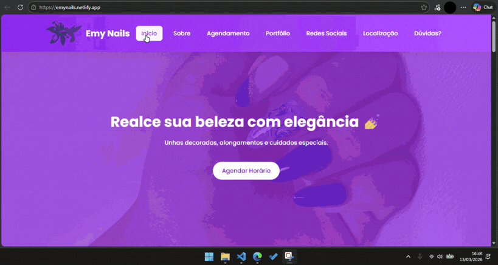

# Studio Emy Nails Website
Website desenvolvido para apresentar os serviços da Emy Nails, permitindo que clientes conheçam os trabalhos realizados e entrem em contato facilmente.

## Acesse o site
https://emynails.netlify.app

## Preview

## Funcionalidades

- Apresentação dos serviços

- Galeria de trabalhos com "Ver mais"

- Layout responsivo para celular

- Contato direto pelo WhatsApp com mensagens personalizadas para cada tipo de agendamento e dúvida

- Links para redes sociais

- Mapa de localização

## Tecnologias utilizadas

HTML5

CSS3

JavaScript

## Estrutura do projeto
Site Emy Nals
│
├── index.html
├── style.css
├── script.js
│
├── images
│   ├── unha1.jpeg
│   ├── unha2.jpeg
|   ├── unha3.jpeg
│   └── unha4.jpeg
│
├── preview.gif
|
└── README.md

## Como rodar o projeto

Clone o repositório:

git clone https://github.com/gabriellunelli/studio-emy-nails.git

Abra o arquivo:

index.html

no navegador.

## Objetivo

Este projeto foi desenvolvido para suprir necessidade e facilitação de agendamentos, e também para prática de desenvolvimento web e criação de sites para pequenos negócios, demonstrando habilidades em front-end e design responsivo.

## Autor

Gabriel Lunelli

GitHub:

https://github.com/gabriellunelli
